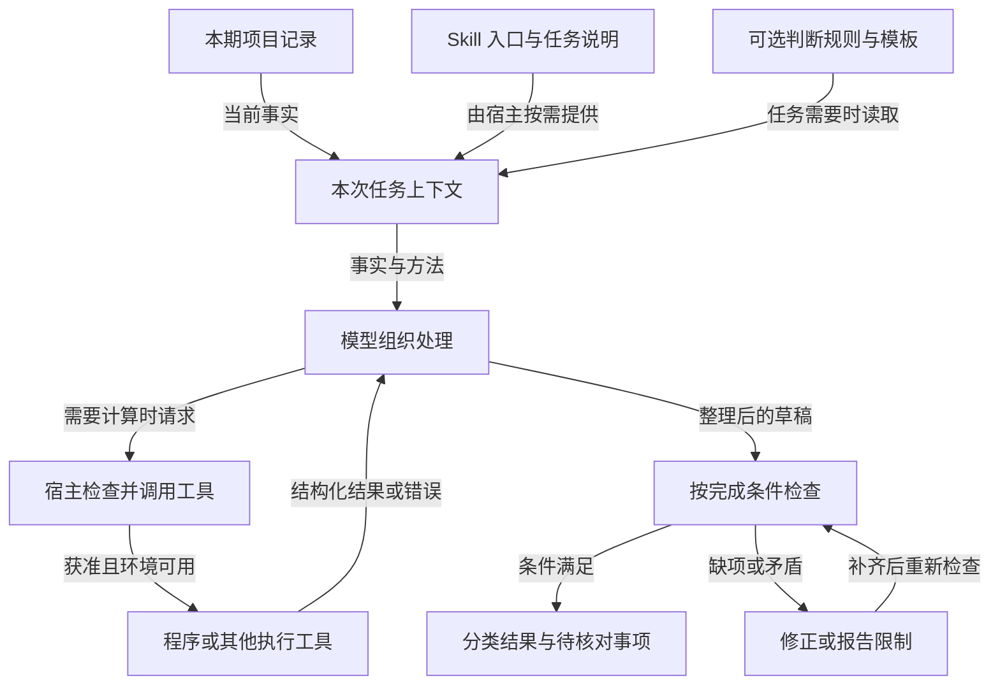
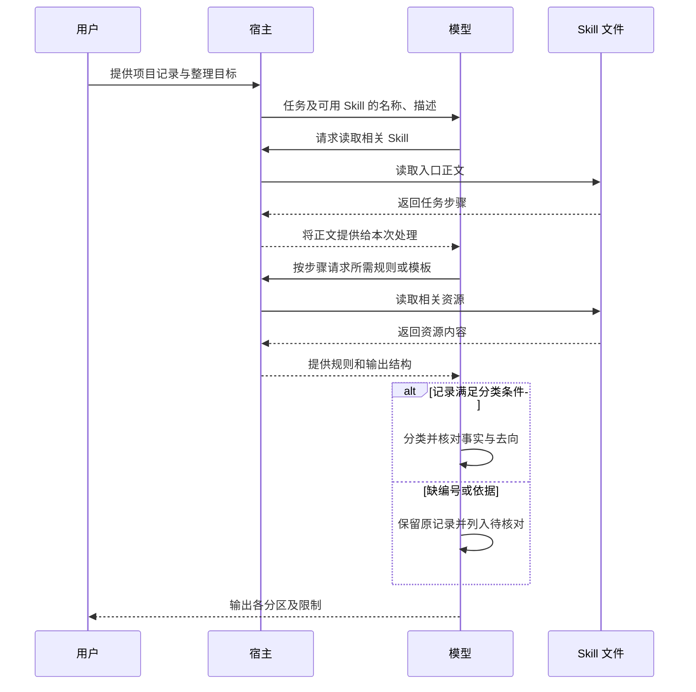

# Skill 是什么：把一次说明变成可复用的方法

模型能够写一份周报，却不一定知道哪些记录可以算作完成、怎样处理重复事项，以及信息不够时应当停在哪里。每次重新解释这些要求可以解决眼前的问题，但难以让方法长期保持一致。

Skill 将一类任务的说明与必要资源组织成可复用的文件包。理解它的关键，是区分**本次事实、处理方法、执行能力和完成证据**。

本文讨论支持 Agent Skills 格式的环境。周报记录与处理规则均为教学示例；第 7 章提供手工验证方法，不宣称做过模型效果对照实验。

## 1. 问题：同一种任务，为什么每次都要重新交代

假设每周需要把项目记录整理为“已完成、进行中、风险、下一步、待核对”五部分。你希望改变的是记录内容，保持稳定的是判断口径。

一句“帮我写周报”没有完整指定任务。模型仍然不知道：计划开始能否写成已经完成？描述相近是否算同一事项？没有编号的记录应当丢弃、合并还是保留？

这些缺口不能只靠文字是否通顺来检查。先把成功标准写成可以逐项核对的条件：

| 要素 | 本例约定 |
| --- | --- |
| 输入 | 本期提供的项目记录，不补充未提供的进展 |
| 身份 | `id` 标识事项；缺失时进入待核对 |
| 分类 | 按明确状态分类，不能把计划改写为完成 |
| 完成依据 | `done` 还需要非空的 `evidence` 字段 |
| 重复处理 | 同一编号、内容完全相同才折叠；冲突保留待核对 |
| 输出 | 五个分区，原始记录均有去向 |

这里把“有完成依据”简化为存在非空文字，方便演示。真实任务还需要核实依据对应的对象、时间和结果；填写了一句说明，并不能证明工作确实完成。

## 2. 推导：可复用的到底是什么

### 2.1 把事实、方法与能力分开

**本次事实会变化。** 这周任务 A 完成，下周可能出现任务 B。把旧周报当作新事实会造成错误，因此历史输出不能直接替代当前输入。

**方法可以相对稳定。** 编号怎样识别、状态怎样分类、冲突怎样呈现，往往能重复使用。

**方法需要被当前执行过程实际读取。** 文件保存在磁盘，只说明有一份文件；模型只有在相关内容进入可用上下文后，才能据此处理本次任务。

**有方法还可能缺少动作能力。** “运行检查程序”是一项指令，执行程序需要宿主提供相应工具和环境。宿主是组织模型调用、上下文、工具与权限的应用程序。

因此，一种可行设计是把稳定的方法独立保存，按任务需要加载，再与本次输入一起使用。这解释了 Skill 的价值，但不意味着所有重复任务都必须采用 Skill。

### 2.2 为什么不一直复制提示词

短流程完全可以复制提示词。问题出现在方法逐渐包含判断规则、模板、脚本和异常处理时：同一规则可能被复制成多个版本，引用关系容易丢失，长说明也会占用当前上下文。

文件包提供可组织、可维护的承载形式。任务简单、使用次数少时，一段清楚的提示词通常就够；任务重复且有稳定口径时，将方法独立维护才更有收益。

### 2.3 Skill 改变了哪一层

| 对象 | 承担的职责 | 单独存在时不能证明什么 |
| --- | --- | --- |
| 本次输入 | 提供待处理事实 | 处理口径已明确 |
| Skill | 提供任务方法及可选资源 | 方法被选择、读取或正确执行 |
| 模型 | 根据当前上下文生成内容和行动请求 | 外部动作已经发生 |
| 工具 | 执行被支持的读取、计算或操作 | 整个任务已满足要求 |
| 验证过程 | 将结果与完成条件比较 | 未检查部分也正确 |

加载 Skill 的这条路径改变的是当前可用的信息与资源，不是对模型权重进行训练。它也不保证跨会话永久记忆；新会话怎样获得方法取决于宿主的发现与加载机制。

## 3. 最小例子：四条记录怎样变成有边界的结论

先约定状态映射：`done` → 已完成，`doing` → 进行中，`blocked` → 风险，`planned` → 下一步。未知状态进入待核对。

| 原始序号 | id | title | status | evidence |
| --- | --- | --- | --- | --- |
| 1 | T-101 | 修复登录超时 | done | 用例 L-7 已通过 |
| 2 | T-102 | 增加导出功能 | planned | 空字符串 |
| 3 | T-103 | 对接通知接口 | blocked | 等待接口字段确认 |
| 4 | 空字符串 | 优化列表查询 | doing | 空字符串 |

按规则逐步推演：

1. 第 1 条有编号、明确状态与非空依据，进入已完成，保留依据原文。不能进一步扩写成“已上线”或“全部回归通过”。
2. 第 2 条进入下一步。即使标题听起来像一项成果，`planned` 也不能变成 `done`。
3. 第 3 条进入风险，保留阻塞原因。不能自动推断何时解除阻塞。
4. 第 4 条因缺少编号进入待核对，保留原始序号和内容，不能凭名称相似合并到其他事项。

得到的分类数量是：已完成 1、进行中 0、风险 1、下一步 1、待核对 1。分区为空也有含义：输入中没有满足该分区条件的记录。

### 只改变一个条件

现在将第 1 条的 `evidence` 改为空字符串，其他条件不变。预期是第 1 条从已完成移到待核对，而非由模型补写一个依据。此时已完成 0、待核对 2，其余数量不变。

这次变化说明：有价值的方法不只是规定标题，还规定**什么条件允许形成什么结论**。

## 4. 整体机制：方法如何参与一次任务

图 1 回答“输入和方法在哪里汇合”。它是职责示意，不要求一个产品恰好拥有这些独立模块。



只用文字规则即可完成的小任务，不需要经过程序分支。涉及真实系统时，也可以通过工具取得事实；本例直接使用给定记录，不连接外部服务。

检查失败时不能无限重试。事实缺失且无法补充，应保留待核对项并说明无法下结论的原因；方法不明确，应停止依赖该方法的判断。

## 5. 一次过程：从获得说明到检查结果

图 2 展示一种常见的按需加载路径。发现时可先提供名称与描述，选中后再加载正文，必要时继续读取资源。具体读取方式由宿主实现。



这个过程有两个容易混淆的边界：请求读取不等于读取成功，输出了五个标题不等于分类正确。前者要看内容是否返回并进入上下文，后者要逐条检查记录。

渐进加载的目的是按需要提供详细内容，减少初始上下文中的无关信息。它不承诺总耗时更短、总 Token 必然减少，也不意味着读完的文件会自动从上下文清除。

## 6. 表示：入口、规则与记录各自保存什么

最小 Skill 可以只有一个 `SKILL.md`。入口的 YAML 元数据包含 `name` 和 `description`，正文保存任务说明；脚本、参考文件、模板按需要增加。

| 层次 | 本例需要表达的内容 | 容易出现的错误 |
| --- | --- | --- |
| 名称与描述 | 用于按已定义规则整理项目记录 | 描述为“处理一切任务”，难以判断适用范围 |
| 步骤 | 先验证记录，再分类，最后核对去向 | 只写“生成高质量周报”，没有决策条件 |
| 规则 | 分类映射、缺失处理、去重口径 | 把相似文字当成同一身份 |
| 模板 | 五个分区，包括待核对 | 模板缺少异常出口，导致问题记录消失 |
| 本次记录 | 编号、事项、状态、依据 | 把旧输入固化到方法中并当作新事实 |

对输出进行核对时，可以使用一个守恒关系：

```text
原始记录数 = 正常分区覆盖的原始行数 + 待核对覆盖的原始行数
```

这里计算的是“覆盖的原始行数”，不一定是输出条目数。例如两条完全相同的记录折叠成一个条目，仍须保留两个原始序号。否则数量减少既可能表示正确去重，也可能表示静默丢失。

这不是某个 Skill 协议规定的数据模型，而是本例用于验证信息没有丢失的设计。

## 7. 验证：先证明规则清楚，再评估模型表现

### 7.1 不依赖模型的手工核对

只需第 3 章的表格与规则即可完成：

| 操作 | 应观察到的结果 | 检查什么 |
| --- | --- | --- |
| 使用原始四条记录 | 分类数量为 1、0、1、1、1 | 基本分类与缺编号出口 |
| 删除第 1 条完成依据 | 已完成变 0，待核对变 2 | 不编造依据 |
| 再追加一条与第 2 条完全相同的记录 | 下一步仍为 1 个事项，覆盖 2 个原始序号 | 正确折叠且可追踪 |
| 将追加记录改为同编号、不同状态 | 两条 T-102 一起进入待核对 | 冲突不会被任意覆盖 |

这些是规则推演的预期，不能用来声称某个模型实际遵循了规则。

### 7.2 怎样做有解释力的模型对照

若要判断 Skill 是否改善任务表现，应保留同一模型、工具条件与输入集，分别运行有无该方法说明的任务。记录分类正确率、原始记录覆盖率、无依据新增事实的数量，以及耗时和 Token。

测试集至少包含正常、缺字段、冲突和不适用任务；同一条件多次运行，才能观察波动。只挑一次好结果，无法区分方法带来的改变与随机差异。

还应明确对照问题：对比“没有规则”是在测规则的价值；对比“相同规则直接放入提示词”才更接近测文件组织和按需加载的价值。不能把二者混为一个提升结论。

## 8. 取舍：什么情况下值得使用

Skill 的收益来自方法集中维护和按需复用，代价来自规则维护、加载成本、资源依赖与持续验证。

| 条件或现象 | 判断与处理 |
| --- | --- |
| 一次性的简单改写 | 清楚说明要求即可，不必增加文件结构 |
| 长期重复、口径稳定 | 适合沉淀成方法，并用边界样本检验 |
| 规则本身仍有争议 | 先明确判断口径，包装成 Skill 不会消除分歧 |
| 外部动作缺少工具 | 补齐执行能力；文字步骤不会自行执行 |
| 输出稳定但持续错分 | 检查规则与输入假设，稳定不等于正确 |
| 方法越来越长 | 按使用时机拆分资源，检查是否引入无关约束 |

Skill 可以帮助组织任务，但不承担事实凭空补全、权限自动授予或任意场景正确性的保证。自动选择也是需要单独验证的环节。

## 9. 迁移练习

**解释题：五个标题都齐全，为什么仍不能判定成功？**

参考解答：标题只满足输出结构。还要检查每条记录的身份、分类依据、异常去向和事实保真度。例如把 T-102 写进已完成，即使排版完整也不满足规则。

**预测题：给两条内容相近但编号不同的事项，应该合并吗？**

参考解答：不能按本例规则合并。规则使用编号判断身份；文字相似不足以证明是同一事项。若业务确实需要语义合并，必须另行定义依据和冲突处理。

**迁移题：将方法改用于故障复盘，哪部分可以复用？**

参考解答：可以复用“事实与方法分离、信息不足保留待核对、结果逐项核验”的结构。周报状态映射不能直接照搬；复盘应重新定义事件时间、影响、恢复动作和根因证据等完成条件。

## 10. 技术速查

```text
重复任务 → 找出稳定口径 → 保存方法与必要资源
         → 当前任务实际加载 → 配合输入与工具执行 → 按证据检查结果
```

- `SKILL.md` 是方法入口，可选资源服务于具体步骤。
- 本次输入提供事实，Skill 提供方法；二者不能相互替代。
- 读取方法不会自动训练模型，也不会自动执行程序。
- 检查结果时同时看正常输出、异常出口和原始记录覆盖。
- 有效性应通过对照和边界样本验证，不能由“已安装”推出。
