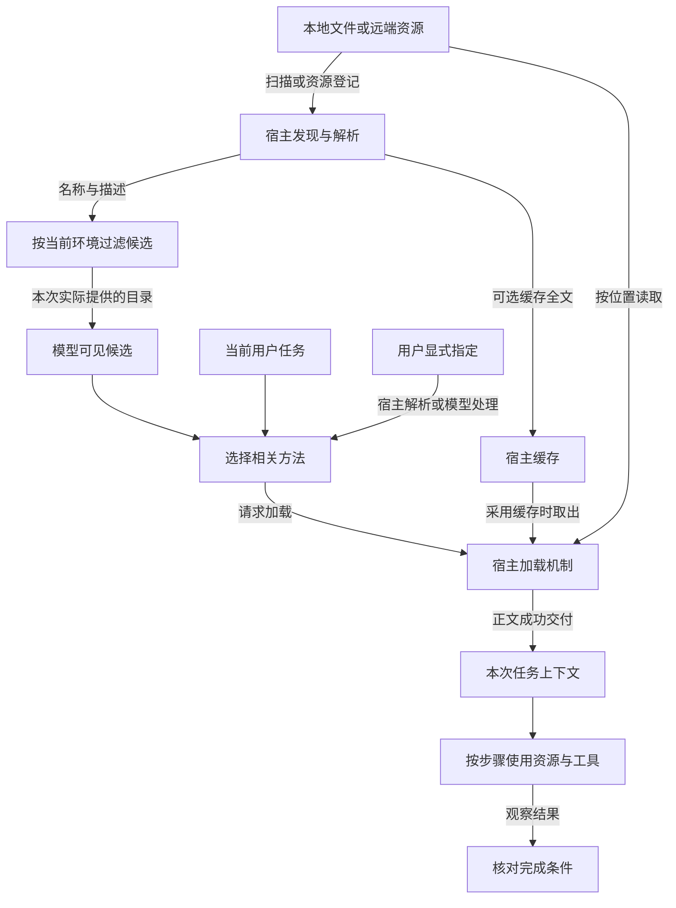
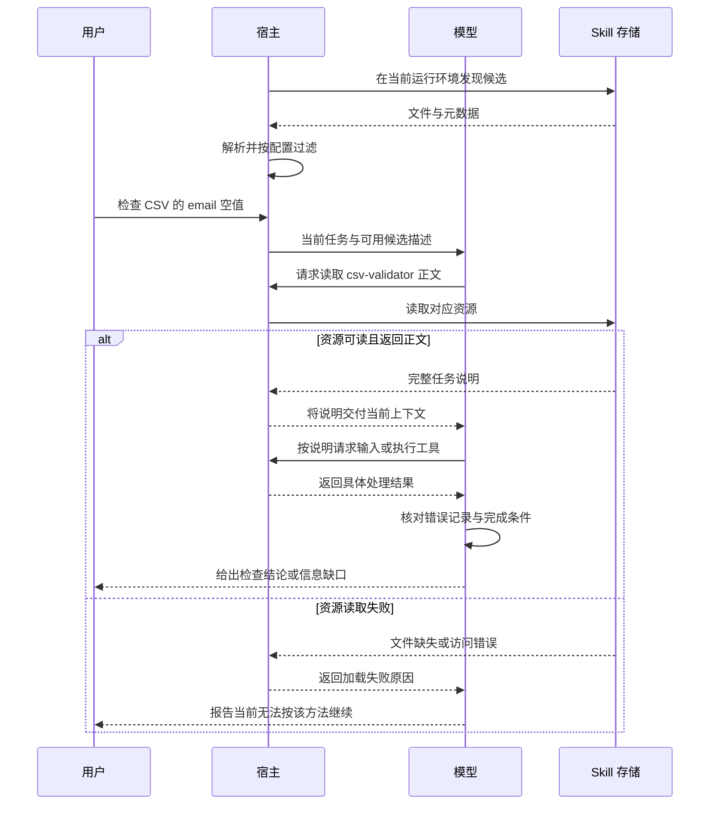

# Skill 的发现、选择与加载：定位“装好了却没用上”

把 Skill 放进目录后，Agent 仍然直接回答，没有按预想的方法处理。此时“没有触发”只是一个现象，可能对应文件未被发现、候选未进入上下文、没有被选中、正文读取失败，或加载后没有正确执行。

排查的关键，是沿着信息传递过程逐段检查：**文件在哪里，谁知道它存在，谁选择它，正文怎样到达当前任务，执行又留下了什么证据。**

本文讨论常见的按需加载机制，不规定某个客户端的安装目录、调用语法或匹配算法。候选名称、任务和运行记录均为教学构造；表中的结果不是对真实客户端触发率的测量。

## 1. 问题：安装状态为什么不能回答使用状态

考虑一个用于校验 CSV 文件的 `csv-validator`：它要求按给定列定义检查字段，并输出错误行号，不修改原文件。

当前请求是：“检查这个 CSV 的 `email` 列是否有空值，列出记录序号，不修改文件。”你期待 Agent 使用这个方法。但即使本地能看到 `SKILL.md`，也还不能证明当前会话能使用它。

| 层次 | 要回答的问题 | 可观察证据举例 |
| --- | --- | --- |
| 文件存在 | 对应内容是否存储在某个位置？ | 文件内容与路径 |
| 宿主发现 | 当前运行环境是否扫描或接收了它？ | 宿主发现记录或资源登记 |
| 候选可见 | 当前模型输入中是否包含相关名称与描述？ | 本次请求的候选目录或等价记录 |
| 选择发生 | 是否决定使用这个 Skill？ | 激活请求、读取请求或显式选择处理记录 |
| 正文加载 | 正文是否成功提供给本次处理？ | 内容返回及上下文交付记录 |
| 正确执行 | 是否完成规定步骤并核对结果？ | 具体执行与结果证据 |

这些证据属于不同层。某产品不暴露模型输入时，就可能无法直接确认候选可见；应明确可观察范围，不能用猜测补齐。

## 2. 推导：为什么需要把“触发”拆成几个步骤

### 2.1 存储位置与运行位置可能不同

模型没有对所有磁盘文件的天然可见性。宿主需要从实际可访问的位置发现文件，或通过资源服务提供它。你电脑上的文件若没有同步到远端执行环境，远端任务不会仅凭相同名称获得内容。

因此，第一步要确定当前会话到底运行在哪里，以及它使用哪种发现机制。统一文件格式不能推出统一安装路径。

### 2.2 完整内容与候选摘要承担不同作用

把所有方法全文放进上下文会占用空间，也会混入当前任务不需要的步骤。常见设计先提供名称和适用描述，选中后再提供详细正文。

于是描述需要帮助判断“这项任务是否适合使用该方法”，正文则负责“选中后怎样做”。如果关键适用条件只藏在未加载的正文中，它就不能帮助最初的选择。

### 2.3 选择与读取不是同一件事

选择可以由模型结合任务和候选描述做出，也可以来自用户明确指定，或宿主自己的路由。开放格式没有要求所有宿主采用同一套关键词、相似度分数或阈值。

无论是谁选择，详细方法仍须通过文件读取、专用激活工具或宿主注入进入当前上下文。发出了读取请求却得到“文件不存在”，仍然没有加载正文。

### 2.4 正文进入上下文只是执行前提

正文到达之后，模型还可能需要读取资源、执行程序和检查结果。此时缺少运行时或权限属于执行问题，继续改描述不一定有效。

## 3. 最小例子：让适用范围足够具体

假设当前模型能看到下面三个候选。名称与描述只是教学设计，不代表已安装工具。

| 名称 | 描述 |
| --- | --- |
| `csv-validator` | 按给定列定义检查 CSV 的缺失字段与格式错误，报告记录序号；适用于已有 CSV 和明确校验要求，不修改文件 |
| `csv-formatter` | 调整 CSV 的列顺序和输出格式；适用于明确要求重排或格式转换的任务 |
| `text-translator` | 翻译自然语言文本并保留原意；适用于语言转换任务 |

对于检查 `email` 空值的任务，第一项在输入类型、动作和输出上都符合预期；第二项负责改格式，第三项负责翻译。

这个对照说明描述应表达可区分的任务边界，但不能由此声称任何模型都必定选中第一项。最终选择仍需观察实际记录。

### 改变一个条件：描述写得更宽

将第一项改为“处理所有数据问题，自动获得最佳结果”，会损失 CSV 输入、校验动作、错误报告和不修改文件的边界。描述变得宽泛，却没有增加实际能力，也更难区分它与格式转换方法。

### 再改变一个条件：任务缺少列定义

请求变成“看看这个 CSV 对不对”，仍可能适合选择校验方法，但执行前需要明确校验标准。**可以选择方法**不等于**已有足够信息执行所有检查**。

相反，“把‘CSV 校验失败’翻译成英文”虽然包含 CSV 和校验两个词，目标仍是翻译。仅凭关键词出现就触发校验，会造成误选。

## 4. 架构：目录、模型上下文和执行环境的边界

图 1 描述一种常见实现的职责关系。宿主缓存正文与把正文交给模型是两种不同状态，图中分别表示。



宿主可能有禁用、作用域、访问权限或同名优先级等过滤规则；具体行为需要按产品核对。不能把一个客户端的优先级或缓存刷新方式当作所有环境的统一事实。

文件名、候选名和实际读取位置也应对应。存在同名方法时，只看到名字可能无法判断加载了哪个版本，需要进一步看实际内容或资源标识。

## 5. 时序：怎样证明正文真正到达了任务

图 2 使用“读取文件式激活”作为示意。若宿主采用专用激活工具或直接注入，消息形式会改变，但仍要区分选择、返回与上下文交付。



用户显式指定可以减少自动选择的不确定性，但不补齐缺失文件、依赖或执行权限。显式调用的命令形式也取决于产品，不应假设任何环境都支持同一符号。

## 6. 证据：把“没触发”改写成可定位的状态

以下字段组成一个教学排查表，不是 Agent Skills 规定的日志格式，也不要求真实产品保存同名字段。

| 字段 | 示例含义 | 建议记录方式 |
| --- | --- | --- |
| `skill_id` | 当前排查的候选及其实际位置 | 名称配合路径或资源标识 |
| `session_id` | 证据属于哪次会话 | 防止把其他会话的成功混入 |
| `discovered` | 宿主是否发现 | 是 / 否 / 未知 |
| `catalog_visible` | 候选是否进入本次模型输入 | 是 / 否 / 未知 |
| `selected` | 是否选择该方法 | 是 / 否 / 未知 |
| `body_delivered` | 正文是否交付当前上下文 | 是 / 否 / 未知 |
| `execution_checked` | 执行结果是否按要求核验 | 是 / 否 / 未知 |

“未知”十分必要。缺少日志可能表示没有记录、记录不对外展示或采集失败，不一定表示步骤没有发生。

同样，最终答案写得像某个模板，也不能证明使用过对应 Skill。模型可能独立生成相似文本，或者模板已经通过其他方式进入上下文。

### 按最早出现问题的位置排查

| 已有证据 | 当前可下的结论 | 下一步检查 |
| --- | --- | --- |
| 本地有文件，远端宿主扫描未发现 | 当前发现环节未成功 | 运行位置、资源同步与扫描范围 |
| 宿主发现了，当前候选目录未包含 | 发现到候选提供之间有缺口 | 禁用、过滤、作用域与同名覆盖 |
| 当前候选可见，未选择 | 在本次条件下没有选择该方法 | 任务意图、描述边界与选择策略 |
| 请求了正文，但读取返回错误 | 本次加载失败 | 资源位置、访问条件与错误内容 |
| 正文已交付，运行程序被拒绝 | 加载已完成，执行受阻 | 实际工具、运行环境与权限 |
| 正文与执行都有证据，输出错误 | 不能归结为未加载 | 步骤、工具结果与最终核验 |
| 只有最终答案，没有中间记录 | 机制证据不足 | 取得可观察记录后再判断 |

即使候选可见，描述也不是唯一变量。工具说明、其他候选、任务上下文和宿主策略都可能影响选择，因此排查时要保持其余条件尽量稳定。

## 7. 验证：分开测选择、加载与输出

### 7.1 手工判读三段构造记录

以下记录用于检验排查思路，不连接任何真实客户端。

```text
记录 A
  当前候选包含 csv-validator
  发出读取请求
  读取返回 FILE_NOT_FOUND
  最终答案称“已按规范检查”

记录 B
  当前候选包含 csv-validator
  正文成功返回并交付上下文
  执行工具返回 PERMISSION_DENIED
  未取得 CSV 检查结果

记录 C
  正文成功返回并交付上下文
  检查程序返回第 3、8 条记录 email 为空
  最终报告只写第 3 条
```

预期判读：A 是加载失败，最后一句话不能覆盖失败事实；B 是执行受阻，不应继续归因为描述没写好；C 已加载且有执行结果，问题出在后续整理或核验，漏掉第 8 条。

### 7.2 单独验证自动选择

先为样本规定“是否应该选择 `csv-validator`”，再观察是否选中。可构造四类请求：

| 请求 | 是否应选择 | 理由 |
| --- | --- | --- |
| 检查 CSV 的必填列是否为空 | 是 | 明确匹配输入、动作与输出 |
| 按这份列定义找出 CSV 格式错误 | 是 | 任务表述不同，目标相同 |
| 把一句包含“CSV 校验”的话翻译成英文 | 否 | 关键词相同，实际目标是翻译 |
| 将 CSV 的列重新排序并另存 | 否 | 格式转换，不是本方法的校验任务 |

若涉及多个方法协作，应先约定允许选择哪些方法；不要用含糊的答案集评价模型。

假设一组**人为构造的计数**如下：10 个应选任务中选中 8 个，漏选 2 个；10 个不应选任务中误选 1 个，其余 9 个未选。

```text
选择精确率 = 正确选中数 / 全部选中数 = 8 / (8 + 1) ≈ 88.9%
选择召回率 = 正确选中数 / 应选任务数 = 8 / (8 + 2) = 80%
```

精确率低提示误选较多，召回率低提示漏选较多。这个例子只是演示计算方法，不能作为某个 Skill 的实测性能；分母为零时，相应指标应记为未定义，而不是自动填 100%。

### 7.3 避免把三个分母混在一起

实际实验可以分别统计：

- 选择表现：在全部已标注请求上统计应选、误选和漏选。
- 加载表现：在已发起加载的请求中，检查正文是否成功交付。
- 输出表现：在实际完成执行的任务中，逐项核对输出；另保留全量任务的最终完成比例，防止失败样本从统计中消失。

固定模型、候选集、工具条件与测试输入；修改描述后重复正例、反例和边界任务。不得只用显式调用成功来证明自动选择准确，也不得只测选择就声称结果正确。

## 8. 取舍：怎样修正问题而不扩大误选

| 做法 | 能解决的部分 | 不能由此保证的部分 |
| --- | --- | --- |
| 描述包含输入、动作和输出 | 提高候选之间的可区分性 | 每次都选择正确 |
| 补充典型适用与不适用情形 | 明确边界 | 覆盖所有语言表述 |
| 用户明确指定方法 | 减少本次自动选择歧义 | 文件可读、程序可运行 |
| 在正文写清执行步骤 | 加载后的方法更明确 | 正文加载之前就影响选择 |
| 缓存方法正文 | 可能减少重复读取 | 模型已收到内容、缓存永远最新 |
| 记录各环节证据 | 缩小故障定位范围 | 未被观测环节已经正常 |

写上“所有任务都必须使用”会改变适用边界，而不是证明方法更好。若方法本身只负责 CSV 校验，盲目扩大描述会把更多不适用任务引入执行流程。

本节讨论的是局部定位方法。具体宿主的目录规则、刷新方式、显式调用语法与上下文管理，应以实际实现为准。

## 9. 迁移练习

**解释题：宿主启动时缓存过完整正文，为什么还不能证明模型读到了？**

参考解答：缓存位于宿主的存储层，模型处理依赖本次输入上下文。只有缓存内容被实际交付，才跨过加载边界；宿主读过文件和模型得到正文是两种证据。

**预测题：正文第一行加上“任何任务都必须使用本方法”，能修复发现失败吗？**

参考解答：不能。发现失败时，宿主尚未建立可用候选，正文也未到达模型。应先检查运行位置、发现范围和文件结构。

**迁移题：换成图像处理 Skill，显式指定后仍无法处理图片，先看哪里？**

参考解答：先确认正文是否成功加载，再检查图像输入是否可访问、实际工具是否存在、依赖与权限是否满足。显式指定解决了选择意图，不等于补齐执行条件。

## 10. 技术速查

```text
资源可访问 → 宿主发现 → 候选对当前模型可见
           → 自动或显式选择 → 正文实际交付 → 执行与核验
```

- “没有触发”应拆成具体阶段，再用该阶段的证据判断。
- 描述帮助选择，正文指导执行；未加载正文无法补救候选不可见。
- 文件存在、宿主缓存和模型上下文是不同位置。
- 自动选择、加载成功和结果正确应分开评价。
- 缺少记录时保留未知，不从答案风格推断执行过程。
