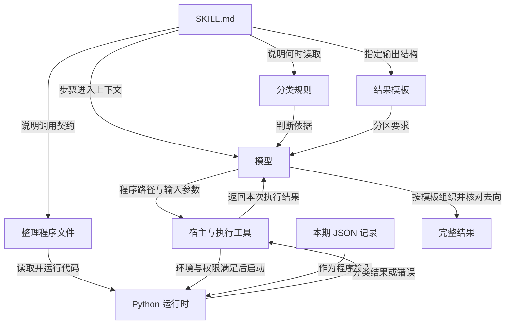
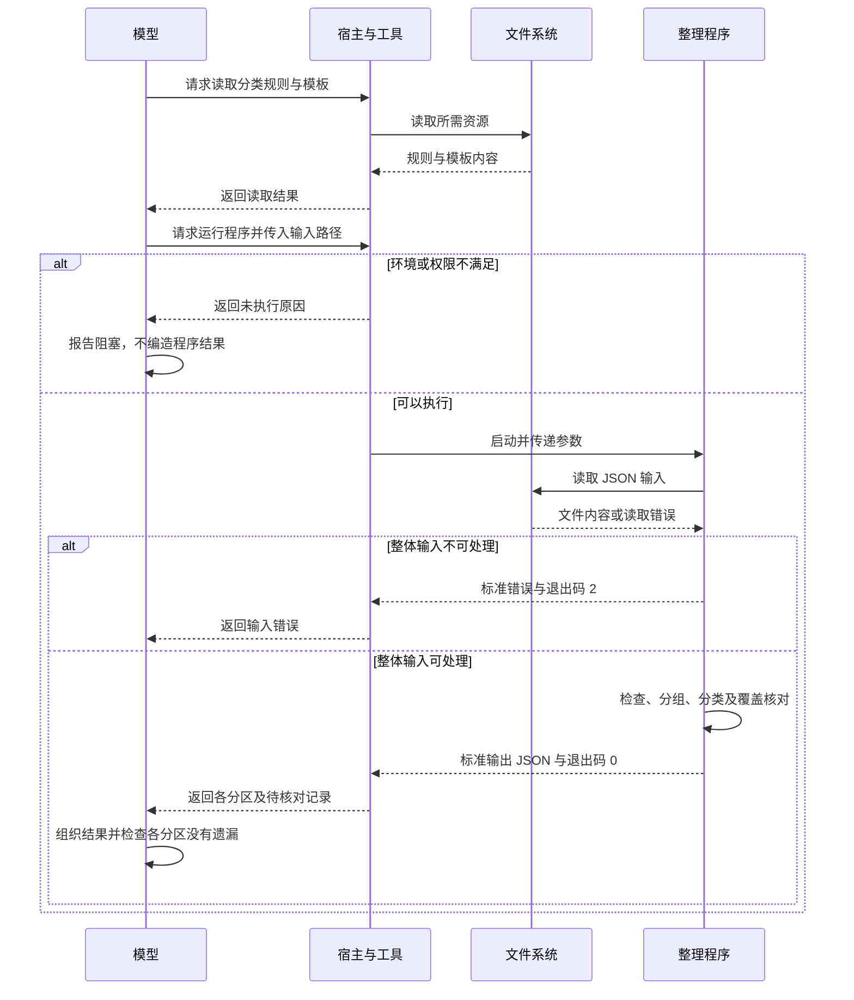

# Skill 文件结构：怎样把说明、规则和程序接成完整流程

一个目录里同时放着说明、模板和程序，不代表它们已经组成可执行的方法。真正需要打通的是：谁在什么条件下读取哪份内容，拿什么输入执行，怎样解释返回结果，以及失败后保留什么。

本文用项目记录整理任务拆解这些连接。先假设宿主已经选中 Skill，重点讨论加载之后的文件职责与执行条件。配套 Python 程序是可独立运行的离线教学示例，不是已经安装、接入模型并完成验证的 Skill。

## 1. 问题：文件齐全，为什么仍然会做错

假设任务是把项目记录分为已完成、进行中、风险、下一步和待核对。你已经准备了分类规则和输出模板，但仍可能遇到这些情况：

- 模型只读了模板，没有读分类条件，把计划写成完成。
- 模型发现程序文件，却不知道参数、运行位置或输入格式。
- 程序成功生成待核对记录，后续排版却把这些记录丢掉。
- 同一编号出现两种状态，程序默认保留最后一条，掩盖了冲突。

这些失败发生在不同边界。要实现完整流程，必须把文件之间的依赖、数据契约和异常出口写清楚。

本例的完成条件是：每条输入都有可追踪去向，状态按明确规则分类，缺失和冲突保留待核对，最终输出包含所有分区。程序正常退出只代表处理过程结束，不能替代这些条件。

## 2. 推导：为什么需要拆开四种职责

### 2.1 步骤解决先后关系

“写一份准确周报”没有说明具体动作。入口需要解释先验证字段，再检查同编号冲突，然后分类，最后核对输出。先后顺序会改变结果：如果先选出一条“有效记录”，再把同编号的异常版本删掉，就可能漏掉冲突。

### 2.2 规则解决判断依据

规则应回答什么是同一事项、什么可以算完成、缺字段怎样处理。它们可以放在入口，也可以按复杂程度拆到参考文件。拆分的目的在于让相关步骤能获得完整依据，不是为了凑齐目录。

### 2.3 模板解决输出结构

模板规定内容放在哪里，不能决定内容真假。例如“已完成”标题下面出现一条 `planned` 记录，结构正确也不能修复语义错误。

### 2.4 程序承担已经明确的处理

明确的字段检查、按编号分组和精确相同比较适合交给程序。程序执行的是代码中的规则，不会因为同目录的说明文档改了，就自动采用新口径。

因此，文档与代码都表达同一业务规则时，必须检查二者是否一致。不能让入口说“冲突待核对”，程序却执行“最后一条覆盖前面”。

## 3. 最小例子：六条记录怎样穿过规则

本例约定输入为 UTF-8 JSON 数组，每条记录恰好有四个字符串字段：`id`、`title`、`status`、`evidence`。标题和编号不得为空；`evidence` 在非完成状态下可以是空字符串。

| 原始序号 | id | title | status | evidence |
| --- | --- | --- | --- | --- |
| 1 | T-101 | 修复登录超时 | done | 用例 L-7 已通过 |
| 2 | T-102 | 增加导出功能 | planned | 空字符串 |
| 3 | T-103 | 对接通知接口 | blocked | 等待接口字段确认 |
| 4 | 空字符串 | 优化列表查询 | doing | 空字符串 |
| 5 | T-102 | 增加导出功能 | planned | 空字符串 |
| 6 | T-103 | 对接通知接口 | done | 收到联调成功记录 |

逐步处理结果：

1. 第 4 行缺少编号，保留原记录并进入待核对，不参与编号分组。
2. T-101 只有一个版本，字段满足要求，进入已完成。这里只检查依据非空，不核实“用例 L-7”是否真的通过。
3. T-102 的两条记录所有字段完全一致，折叠成一个下一步事项，并保存 `source_rows: [2, 5]`。
4. T-103 的状态与依据不同，无法仅凭行顺序确定哪条较新。两条一起进入待核对，保存 `source_rows: [3, 6]`，不保留其中一个为已完成。

最终有 2 个正常事项和 2 组待核对事项，覆盖全部 6 行输入。正常事项覆盖 3 行，待核对覆盖 3 行；输出条目数少于输入行数是折叠造成的，不是丢失。

### 改变一个条件：如果输入带更新时间

本例没有更新时间，所以不采用“最新记录优先”。即使增加时间字段，也要先明确时区、时间来源、相同时间冲突和允许覆盖的字段。直接多加一个字段不会自动形成可靠的冲突解决方法。

当前示例使用严格字段集合；额外字段会进入待核对。若扩展输入格式，应同步修改契约、程序和验证样本。

## 4. 结构：文件负责方法，宿主负责组织执行

一个可能的目录设计如下。它表达职责，不要求每个 Skill 都拥有四类文件；本文附件只交付离线程序与输入，没有安装此目录。

```text
project-record-report/
├── SKILL.md                   任务入口、读取时机、执行步骤
├── references/
│   └── classification.md      分类与异常口径
├── assets/
│   └── report-template.md     五个输出分区
└── scripts/
    └── normalize_records.py   字段检查、编号分组、分类
```

图 1 区分“模型读取的内容”和“执行环境运行的程序”。



入口可以写成下面的形式。它只是与上方目录配套的说明示例；引用的规则和模板需要实际创建后，才能组成完整文件包。

```markdown
---
name: project-record-report
description: 按明确的状态和去重规则整理项目记录，输出分类结果及待核对项；用于已有结构化记录的汇总任务。
compatibility: 运行附带程序需要 Python 3.9 或更高版本及文件读取和程序执行能力。
---

# 项目记录整理

1. 分类前读取 references/classification.md，确认字段与冲突规则。
2. 确认输入文件可访问，并核对运行环境。
3. 在 Skill 根目录运行 scripts/normalize_records.py，使用 --input 传入实际输入路径。
4. 若返回输入错误，先报告具体错误；不编造分类结果。
5. 读取 assets/report-template.md，将正常结果和 pending 全部映射到模板分区。
6. 检查 source_rows 覆盖全部原始记录，保留待核对原因。
```

其中 `name` 用于标识，`description` 提供适用判断信息，`compatibility` 描述环境要求；声明要求本身不创建环境。真正的执行命令还需要解释器，例如第 7 章的 `python3` 调用。

包内引用以 Skill 根目录为基准，例如 `references/classification.md`。运行命令时还要明确工作目录，或由宿主解析成实际路径。相对路径有助于整体移动文件包，但不会自动提供 Python、读取权限或缺失依赖。

## 5. 时序：一次读取与一次执行是两类动作

图 2 假设当前 Skill 正文已加载，输入文件可访问，宿主提供程序执行工具。



个别记录缺字段属于可表达的业务异常，进入 `pending`，不必让整批结果丢失。文件不存在、JSON 语法错误或顶层不是数组，则无法按契约处理，返回输入错误。

这种区分由本例设计决定，并不是所有程序必须采用的退出码或异常策略。真实接入方必须按实际契约解释结果。

## 6. 契约：输入、输出与异常怎样对齐

### 6.1 输入条件

| 字段 | 类型 | 条件 | 作用 |
| --- | --- | --- | --- |
| `id` | 字符串 | 非空，不自动去除首尾空格后合并 | 同编号分组 |
| `title` | 字符串 | 非空 | 保留事项名称 |
| `status` | 字符串 | `done`、`doing`、`blocked`、`planned` | 映射目标分区 |
| `evidence` | 字符串 | `done` 时必须非空 | 保留依据或说明文字 |

编号按原字符串精确比较；标题不用于身份判断。同编号记录先比较全部内容是否一致，再检查字段。程序不做语义去重，不校验事实真伪，不访问证据对应的系统。

### 6.2 输出契约

| 字段 | 内容 |
| --- | --- |
| `completed` | 通过本例条件的 `done` 事项 |
| `in_progress` | `doing` 事项 |
| `risks` | `blocked` 事项 |
| `next` | `planned` 事项 |
| `pending` | 原始记录、原始行号和待核对原因 |
| `summary` | 输入行数、覆盖行数、正常事项数、待核对组数及行数 |

正常事项带 `source_rows` 数组。待核对组带 `records` 数组，避免只保留错误消息而丢失原值。这里的行号是 JSON 数组中从 1 开始的记录序号，不是文件物理行号。

六行输入的摘要应为：

```json
{
  "input_rows": 6,
  "covered_rows": 6,
  "accepted_items": 2,
  "pending_groups": 2,
  "pending_rows": 3
}
```

### 6.3 错误的两层含义

| 错误或结果 | 行为 | 后续处理 |
| --- | --- | --- |
| `MISSING_OR_INVALID_ID` | 当前记录待核对 | 补齐身份信息 |
| `CONFLICTING_ID` | 同编号整组待核对 | 查明冲突，不能任意覆盖 |
| `FIELD_SET_MISMATCH` | 缺少或多出字段 | 核对输入格式 |
| `INVALID_FIELD_TYPE` / `EMPTY_TITLE` | 字段类型或内容不合法 | 修正字段 |
| `UNKNOWN_STATUS` | 不猜测分类 | 明确状态映射 |
| `MISSING_COMPLETION_EVIDENCE` | 完成记录待核对 | 补充可核查依据 |
| `INVALID_RECORD` | 非对象记录待核对 | 修正记录结构 |
| `INVALID_INPUT`，退出码 2 | 整体输入读取或解析失败 | 先修复文件与格式 |
| 退出码 0 且 `pending` 非空 | 程序完成分类，仍有待核对项 | 最终结果保留限制 |

为避免 JSON 解析时覆盖事实，命令行入口还拒绝同一对象中的重复字段名，以及 `NaN`、`Infinity` 等非标准 JSON 常量。

## 7. 实践：运行一个完整、可检查的离线步骤

环境：Python 3.9 或更高版本，只使用标准库。程序读取指定文件并将结果写到标准输出，不修改输入，不连接模型、数据库或网络服务。

附件：

- [整理程序](examples/normalize_records.py)
- [六行示例输入](examples/input.json)
- [边界验证程序](examples/check_examples.py)
- [完整预期输出](examples/expected-output.json)

在本文所在目录执行：

```bash
python3 examples/normalize_records.py --input examples/input.json
python3 examples/check_examples.py
```

第一条命令应输出第 6 章的摘要，以及完整分区数据。核对 T-102 的 `source_rows` 为 `[2, 5]`，冲突 T-103 的原始序号为 `[3, 6]`，没有条目被遗漏。

第二条命令检查正常分类、缺编号、完成缺依据、完全重复、双向顺序冲突、未知状态、非法字段、空输入、教材输入和命令行错误契约。它验证离线处理逻辑，不验证模型是否会正确选择、调用或解释该程序。

还可以复制输入做三次单条件实验：

1. 删除第 6 条：T-103 应从待核对回到风险分区。
2. 将第 1 条的依据清空：T-101 应移到待核对。
3. 仅给第 4 条补上 `id: T-104`：它应进入进行中。

程序输出之后若再接模型排版，应增加一次下游检查：正常与待核对分区的记录是否都出现在最终结果中。上游程序正确不代表下游整理不会丢信息。

## 8. 取舍：文件结构怎样保持必要且足够

| 设计选择 | 收益 | 代价或边界 |
| --- | --- | --- |
| 规则直接写在入口 | 小任务易读、少一次读取 | 内容多时入口过长 |
| 独立参考文件 | 按步骤读取相关规则 | 必须说明读取时机和路径 |
| 独立模板 | 输出结构容易统一维护 | 模板缺分区会造成信息丢失 |
| 程序执行明确规则 | 同样输入按明确逻辑处理 | 代码和规则必须同步维护 |
| 严格字段集合 | 发现意外格式变化 | 合法扩展也需升级契约 |
| 冲突整组待核对 | 避免无依据覆盖 | 需要后续人工或系统补证 |

本例一次把文件读入内存，适合小型教学数据，不声称覆盖大文件流式处理。没有版本号、时间顺序和权威状态来源时，也不实现自动冲突消解。

文件可移动与环境可运行是两个条件：脚本放进包里不会安装解释器，声明兼容性不会授予执行权限。把更多依赖藏进脚本，也不会减少实际依赖。

## 9. 迁移练习

**解释题：修改分类说明后，为什么程序结果可能完全不变？**

参考解答：程序执行代码中的逻辑，未必读取该说明文件。如果规则在文档和代码中分别表达，需要同步修改并运行边界样本；不能把文件相邻关系当作数据依赖。

**预测题：同编号先出现 `done`，再出现 `blocked`，交换顺序会改变分类吗？**

参考解答：本例不会。两种顺序都进入同编号冲突分支。只有业务先定义可信的时序和覆盖规则，才可以根据时间选择版本。

**迁移题：把处理对象换成用户反馈，哪些契约必须重新定义？**

参考解答：反馈身份、重复标准、分类枚举、冲突处理与输出字段都要重新定义。可以复用保留原始序号和核对覆盖的做法，不能沿用 `done` 等项目状态作为通用业务规则。

## 10. 技术速查

```text
入口说明何时做什么 → 规则定义如何判断 → 程序按契约处理
                  → 模板组织全部结果 → 检查正常与异常记录的去向
```

- 最小 Skill 只需入口，参考文件、模板和脚本按需增加。
- 读取说明、启动程序、验证结果分别需要证据。
- 程序路径、参数、环境、输入输出和错误含义应明确。
- 去重不能丢失原始记录归属；冲突不能依赖偶然行顺序解决。
- 退出码 0 与“没有待核对项”是不同结论。
