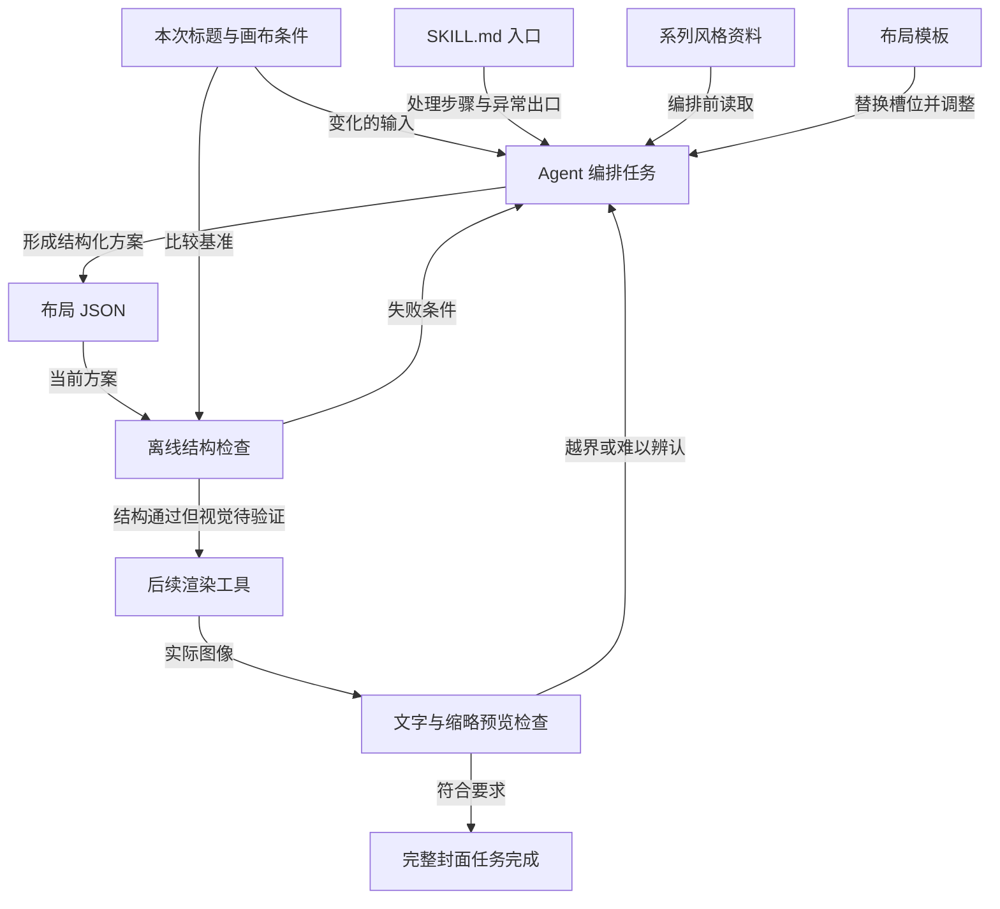
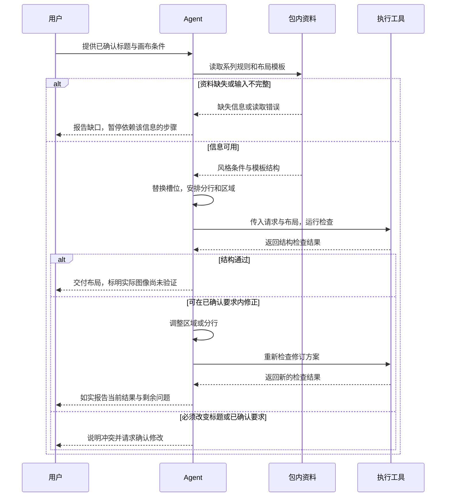

# 构建可复用 Skill：从一次修改中提炼方法

你指导 Agent 做好了一次任务，保存整段聊天，下一次却仍然需要纠正。问题可能不在于说明不够长，而在于记录里混合了本次输入、长期规则、临时修复和真正可复用的处理方法。

构建 Skill 的关键，是把这些内容拆开，让新任务能替换输入，按明确步骤读取必要资料，并用可观察的条件检查结果。

本文使用系列封面作为贯穿案例。封面风格、坐标和任务数据均为教学设定；附带一个完整的**布局规划 Skill 示例包**及离线检查程序，只验证布局数据，不生成图片，也不宣称已完成真实 Agent 自动调用或封面视觉验收。

## 1. 问题：为什么保存一次成功的聊天还不够

第一次请求是：“标题用‘Skill 为什么没生效’，沿用深蓝背景，标题清楚，图形别挡住文字。”下一次标题变成“工具调用卡在哪里”，画面比例也可能变化。

如果直接复制聊天，旧标题与新标题会同时出现；如果把上一次的坐标也固定下来，原来合适的布局可能放不下新内容。

先区分四类信息：

| 聊天中的内容 | 归属 | 下次怎样使用 |
| --- | --- | --- |
| 本次标题、画布尺寸 | 任务输入 | 每次从当前请求取得 |
| 系列的背景、字体与风格要求 | 参考资料 | 使用前读取当前有效规范 |
| 排版、检查、调整的步骤 | 处理方法 | 在适用任务中复用 |
| “这一次把标题向左挪一点” | 局部修正 | 先分析原因，不直接升级为永久规则 |

一次成功证明某组输入和操作得到了可接受结果。复用要求更强：换一个仍处于适用范围内的输入，方法仍然知道怎样处理；遇到超出能力或信息不足的情况，也有明确出口。

## 2. 推导：怎样从具体纠正得到可复用规则

### 2.1 先找到变化量与不变量

标题会变化，但“不擅自改变已确认标题”的要求可以保持。画布比例会变化，但“标题区域位于安全范围内”的检查方式可以保持。背景可能随系列规范变化，但“编排前读取系列规范”的步骤仍然成立。

复用不意味着冻结所有数值，而是把规则表达成当前输入与结果之间的关系。

例如，把“标题固定在横坐标 96”改为“标题区域不得越过当前画布的安全边距”。前者保存了一次结果，后者定义了不同尺寸下都能检查的条件。数值 96 仍可作为某次布局选择，但不应冒充通用原理。

### 2.2 从要求走到可以执行的步骤

“标题清楚”是目标，尚未说明怎样实现和验证。可以补成：读取标题与尺寸 → 尝试布局 → 按语义换行 → 检查位置与遮挡 → 实际渲染 → 缩小预览检查。

其中有些步骤可用程序检查，有些依赖实际观看。把它们分开，才能知道失败发生在哪个环节，而不是给一个笼统的“质量不够好”。

### 2.3 纠正需要经过归因，而非逐条收藏

| 一次纠正 | 需要查明的原因 | 合理沉淀方式 |
| --- | --- | --- |
| 标题向左挪 | 与图形重叠，还是本次审美选择？ | 若是遮挡，保存区域冲突检查；不固定左移量 |
| 字号缩小 | 长标题越界，还是字体不同？ | 保存调整与缩略预览步骤，不规定所有任务都缩字 |
| 背景换浅色 | 系列规范变化，还是单次例外？ | 分别更新系列资料或本次输入 |
| 删除一个词 | 用户确认后的内容修改 | 更新本次标题，不让方法默认删词 |

方法的深度来自“条件、动作、结果与边界”之间的关系，而不是记录了多少条命令。

## 3. 最小例子：标题变长，方法怎样继续适用

假设当前请求为：

```json
{
  "title": "把一次封面修改变成可复用的 Skill",
  "width": 1920,
  "height": 1080,
  "safe_margin": 64
}
```

这些数值只属于本次教学任务。我们先规划两个矩形区域：标题区域为 `(96, 180, 1000, 450)`，主题图区域为 `(1200, 240, 600, 600)`，四个数依次表示左上角 x、y、宽、高，单位为像素。

标题分成两行：

```text
把一次封面修改
变成可复用的 Skill
```

直接拼接两行，仍然等于输入标题。换行改变呈现结构，没有删除文字。

沿着同一个方案推演：

1. 画布为 1920 × 1080，与请求一致。
2. 安全区域的右边界为 `1920 − 64 = 1856`，下边界为 `1080 − 64 = 1016`。
3. 标题右边缘为 `96 + 1000 = 1096`，下边缘为 `180 + 450 = 630`，均在安全范围内。
4. 主题图右边缘为 1800，下边缘为 840，也在安全范围内。
5. 标题右边缘 1096 小于主题图左边缘 1200，两区域在横向分离，因此没有正面积重叠。

这些计算只能证明**声明的区域**满足条件。程序还不知道字形的实际宽度、行距、字体替换或渲染效果，因此不能据此断言文字一定放得下、缩小后一定清楚。

### 只改变一个条件

把主题图的 x 从 1200 改为 500，其他数值不变：两个区域在横向与纵向都有交叠，检查应失败。修正目标是消除冲突，不是记住“主题图永远必须放在 x=1200”。

如果换成竖版 1080 × 1920，原横版坐标可能越界。正确处理是重新安排区域，再走同样的检查，而不是把横版结果原样复制过去。

## 4. 架构：哪些放输入，哪些放方法与资源

图 1 回答“本次内容与可复用内容怎样汇合”。布局检查属于完整封面任务中的一个可执行环节，后续图像渲染另有工具依赖。



图中的渲染与视觉检查是完整任务需要的环节，本文附件没有实现它们。示例包的明确输出是布局方案与结构检查结果。

附件目录为：

```text
examples/
├── request.json
├── layout.json
├── expected-check.json
├── check_examples.py
└── series-cover-layout/
    ├── SKILL.md
    ├── references/style.md
    ├── assets/layout-template.json
    └── scripts/check_layout.py
```

这里使用参考、模板和脚本，是因为它们各自承担了明确职责。简单任务可以只保留 `SKILL.md`；不需要先建满目录，再想办法为每个文件编造用途。

## 5. 时序：资源必须在正确的步骤被使用

Skill 的名称与描述帮助宿主和模型识别用途，正文把资源使用时机连接起来。只有“这里有个模板”，没有说明哪些内容要替换，旧内容仍可能进入新结果。

图 2 假设 Skill 已被发现并加载，展示布局子任务的正常和异常分支。



请求执行、程序运行成功和布局符合要求分别是不同证据。执行工具缺失时，应报告未运行检查；不能把展示的命令或预期输出当作实际结果。

重复调整也要有停止条件。若多次调整仍失败，应定位是否缺少约束、模板不适配或工具能力不足，再报告具体冲突，不能无限重试或悄悄降低要求。

## 6. 契约：把完成条件写成可以核对的关系

### 6.1 输入与布局表示

| 对象 | 必需字段 | 条件 |
| --- | --- | --- |
| 请求 | `title`、`width`、`height`、`safe_margin` | 标题非空；尺寸为正整数；边距非负且未占满画布 |
| 画布 | `canvas.width`、`canvas.height` | 与本次请求相同 |
| 标题 | `title.lines`、`title.box` | 每行非空；拼接后等于原始标题 |
| 主题图 | `graphic.box` | 表示规划区域，不是图像本身 |
| 矩形 | `x`、`y`、`width`、`height` | 整数坐标；宽高为正；位于安全区域内 |

程序使用明确字段集合。额外字段、缺字段、错误类型或重复 JSON 字段名会被拒绝，不会静默丢掉未知信息。

坐标原点在左上角，x 向右增加、y 向下增加。矩形不发生正面积重叠，当且仅当它们至少在一个方向上分离：

```text
A 的右边缘 ≤ B 的左边缘，或 B 的右边缘 ≤ A 的左边缘，
或 A 的下边缘 ≤ B 的上边缘，或 B 的下边缘 ≤ A 的上边缘。
```

边界恰好接触在这个几何模型中允许，但并不自动满足视觉留白要求。

### 6.2 模板故意不带上一任务的标题

附件模板的标题行数组为空，画布和区域尺寸为零。这些都是必须填写的槽位；未经填写直接检查会报输入错误，避免把模板外形误当成可交付结果。

正常示例 `layout.json` 则是已经填写的教学方案。模板与示例有不同职责：模板提供结构，示例帮助理解字段，二者都不能替代当前请求。

### 6.3 三类结果

| 结果 | 退出码 | 可以得出的结论 |
| --- | --- | --- |
| `structure_pass_visual_pending` | 0 | 五项布局声明检查通过，仍需视觉验证 |
| `structure_failed` | 1 | 输入可解析，但有明确条件不满足，查看 `failed_checks` |
| `INVALID_INPUT` | 2 | 文件或数据不符合契约，先修复输入 |

检查通过时仍固定返回 `requires_visual_review: true`。这是输出契约的一部分，让后续步骤能看到未完成的条件。

## 7. 实践：运行布局检查，再换一个输入

环境：Python 3.9 或更高版本，仅使用标准库。程序读取两个 JSON 文件，结果写标准输出，输入错误写标准错误；不修改原文件，不访问网络，不生成图片。

在本文所在目录运行：

```bash
python3 examples/series-cover-layout/scripts/check_layout.py --request examples/request.json --layout examples/layout.json
python3 examples/check_examples.py
```

第一条命令的完整预期输出见 [expected-check.json](examples/expected-check.json)。核心结果应为：

```json
{
  "status": "structure_pass_visual_pending",
  "scope": "declared_layout_only",
  "failed_checks": [],
  "requires_visual_review": true
}
```

这里省略了完整输出中的逐项 `checks` 和 `not_checked` 字段。它不是“封面完成”的总通过信号。

第二条命令验证 10 组场景：长标题、短标题、未经确认改标题、区域重叠、安全边界、边界接触、画布不符、竖版重排、非法结构，以及命令行返回码。测试不调用模型，不证明 Agent 会正确遵循附带 Skill。

建议再亲自修改两处并预测：

- 把 `graphic.box.x` 改成 500：应出现 `regions_do_not_overlap` 失败。
- 把 `title.lines` 改成 `["制作 Skill"]`：区域条件仍可能通过，但 `title_preserved` 应失败。

需要阅读和改写方法时，从 [Skill 入口](examples/series-cover-layout/SKILL.md)进入；具体风格条件在 [style.md](examples/series-cover-layout/references/style.md)，程序在 [check_layout.py](examples/series-cover-layout/scripts/check_layout.py)。示例包未安装到任何客户端，宿主发现与加载需要在实际环境中另行验证。

### 怎样继续验证完整封面任务

将布局交给具备相应能力的渲染工具，读取输出文件的真实宽高，再查看文字、图形和缩略预览。若生成结果没有遵守布局 JSON，原有结构检查不能替代对最终图片的检查。

因此，本文的实跑范围是布局检查程序；实际图像尺寸、字形边界、字体可用性、图形含义和缩略可读性均未验证。

## 8. 取舍：复用多少，固定多少

### 8.1 约束强度与变化空间

把所有坐标固定下来，能得到一致的位置，却可能无法容纳不同标题和画幅。只写“自由发挥”，又可能丢掉系列风格和内容保真要求。

合理的分工是：把必须成立的条件写清楚，把可调整部分留给方法。例如标题不能擅自修改，布局可以在满足安全边界和可读性的条件下调整。

| 现象 | 优先检查 | 不宜直接采用的修复 |
| --- | --- | --- |
| 旧标题出现在新方案 | 模板槽位与当前输入是否被替换 | 在每处再复制一遍新标题 |
| 换长标题就失败 | 方法是否只有固定坐标，是否验证实际字形 | 永久缩小所有标题 |
| 风格与当前系列不符 | 是否读到有效的风格资料 | 继续追加互相冲突的颜色要求 |
| 程序通过但图像难读 | 检查范围是否只覆盖布局声明 | 把“视觉通过”加到脚本固定输出 |
| 保存了文件但 Agent 没用 | 发现、选择和正文交付是否发生 | 不断加长正文 |

### 8.2 修改的对象应对应失败原因

规则不清楚时改方法，系列信息变化时改参考资料，结构起点不适合时改模板，计算逻辑错误时改程序，执行条件缺失时修复环境。不要用一处万能说明掩盖所有问题。

修改之后至少重跑原失败样本与一个原先通过的样本，再加入新的输入。一次修正不应以破坏原有正确条件为代价。

Skill 的文件形式带来组织和维护便利，不会凭空增加模型能力或绘图工具。相同要求直接提供给对话也能参与本次任务；是否值得封装，取决于重复程度、规则稳定性和维护收益。

## 9. 迁移练习

**解释题：为什么“这次把主题图右移 100 像素”不一定适合写进长期方法？**

参考解答：它描述一次修复动作，没有说明成立条件。应先确定是否因为区域重叠、画幅变化或审美偏好，再沉淀相应检查和调整方式。否则换输入后可能把原本正确的图形移出画布。

**预测题：把模板里的旧标题改为空，就能保证 Agent 永远不会用错标题吗？**

参考解答：不能。空槽位减少了旧值残留，但仍需将本次输入实际填入，并将输出文字与输入比较。模板设计和运行验证分别提供不同层面的保障。

**迁移题：把封面任务换成 API 文档生成，怎样做同样的拆分？**

参考解答：本次接口定义和真实代码属于输入；字段与异常解释要求属于方法；团队术语和格式规范属于参考；文章骨架属于模板；可确定的字段完整性检查可以写程序。生成文档仍须与当前接口行为核对，格式合格不能替代契约正确。

## 10. 技术速查

```text
一次任务经验 → 区分输入、规则和临时修复 → 写清条件与步骤
            → 接入必要参考、模板和程序 → 换输入验证 → 按失败原因修订
```

- 保存具体结果与提炼处理方法是两件事。
- `SKILL.md` 连接使用条件与资源，目录数量不代表能力强弱。
- 模板中的变量必须由当前输入填入，历史示例不能冒充当前事实。
- 结构检查只证明实际检查的条件，最终产物还需要对应验证。
- 在保持内容边界的前提下调整布局；需要改变已确认内容时先确认。
