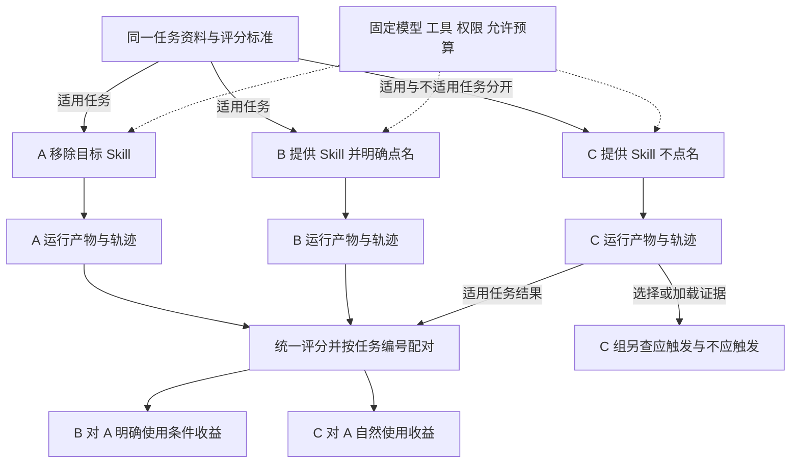
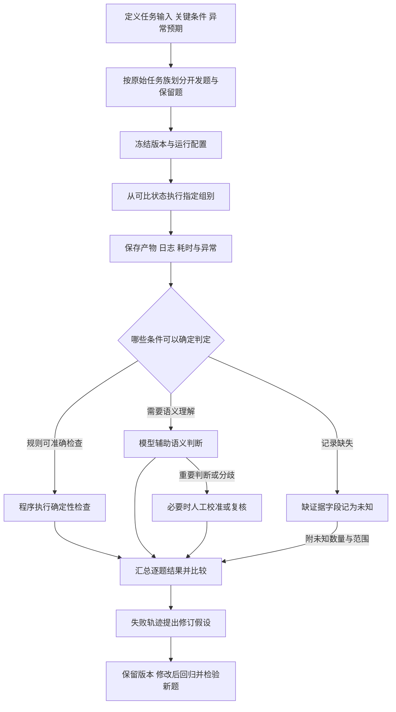
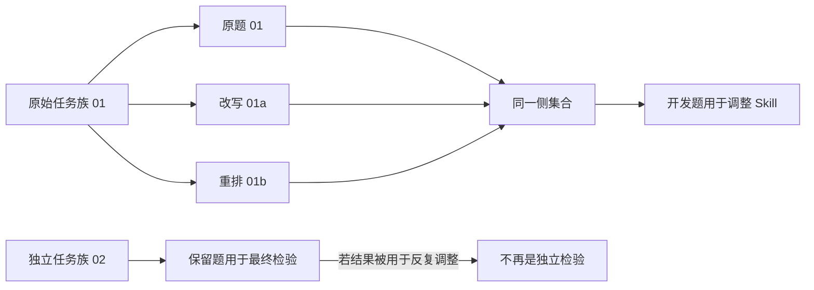

# Skill 有效性与稳定性评估：用对照、重复与证据判断价值

> 适用范围：具有目标 Skill、可重复任务与可观察执行结果的 Agent 评测。A/B/C 是一种实验设计，不是所有宿主必须实现的协议。本文数字全部是人为设定的教学数据，不是某个 Skill 的真实成绩。

**核心问题：** 用了 Skill，任务成功率达到 85%，能否说明它真的有帮助？

**答案：** 先把任务目标变成可检查的成功条件，在可比环境中测量有无目标 Skill 的差异，再检查触发、多次运行、条件变化和成本；每个结论都要能回到具体任务及运行证据。

**阅读准备：** Skill 是给 Agent 使用的方法与资源包；Agent 是决定并执行操作的运行主体；评测运行是一次受控尝试。动手复算只需 Python 3 标准库，不连接模型或工具服务。

## 1. 85% 的成绩，还缺什么信息

设想团队已经整理好一个目标 Skill，要决定是否让它参与日常任务。任务集包含明确输入、需要完成的操作，以及可检查的结果要求。一次运行结束后，只记录“成功”还不够：可能是模型本来就会做，也可能是 Skill 帮上了忙，还可能只是这次运气好。

贯穿本文的实验使用相同的 100 个适用任务，每个任务都保留唯一编号。A 条件移除目标 Skill，C 条件提供目标 Skill 但不点名。教学数据中，A 成功 70 个、C 成功 85 个。我们的目标是解释这 15 个百分点代表什么、没有代表什么。

成功不能只由“生成了文件”决定。每道题在运行前就要写清楚任务预期：资料齐全时可能要求交付正确产物；缺少必要信息时可能要求澄清；遇到不可执行条件时可能要求停止。澄清或停止是否成功，由该任务事先定义的目标决定。

学完后，应能从一份评测记录中区分：结果质量、Skill 触发、重复稳定性、条件扰动下的鲁棒性，以及获得这些结果的成本。

## 2. 从目标推导最少需要的评测机制

目标是判断“加入这个方法包后，任务完成情况是否值得改善”。围绕这个目标，有四个不可省略的问题。

| 缺少什么   | 为什么不能下结论                       | 最少增加什么                          |
| ---------- | -------------------------------------- | ------------------------------------- |
| 成功定义   | 好看、流畅、生成文件都未必完成用户目标 | 可检查的关键条件与异常预期            |
| 可比基线   | 无法区分原有能力与新方法的帮助         | 相同任务和环境下移除目标 Skill 的对照 |
| 逐次记录   | 平均分会掩盖退步，也看不见波动         | 任务编号、每次结果、实际执行轨迹      |
| 成本与边界 | 更高成功率可能换来不可接受的等待       | 耗时、资源、返工和可接受范围          |

评测不要求先建立复杂平台。只要能够固定条件、保留证据并重复运行，就可以从一份任务清单和运行记录开始。平台能帮助自动化，却不能替代正确的成功标准。

这里的**有效性**指在明确目标与条件下观察到的收益；**稳定性**关注同一输入多次运行是否持续达到要求；**鲁棒性**关注说法、信息顺序或工具条件变化后，是否仍符合相应预期。三者相关，但不能用一个总分互相代替。

## 3. 从 70 到 85：先算增益，再找谁受益、谁退步

### 3.1 配对比较，而不是只看两根柱子

100 个任务在 A 和 C 中各运行一次，同一编号始终表示同一道题。设定的逐题结果如下。

| A 结果 | C 结果 | 任务数 | 含义                   |
| ------ | ------ | -----: | ---------------------- |
| 成功   | 成功   |     65 | 两组都满足要求         |
| 成功   | 失败   |      5 | 加入自然选择条件后退步 |
| 失败   | 成功   |     20 | 加入自然选择条件后改善 |
| 失败   | 失败   |     10 | 两组仍未满足要求       |
| 合计   |        |    100 | 同一组适用任务         |

于是 A 的成功数是 `65 + 5 = 70`，C 的成功数是 `65 + 20 = 85`。

- A 成功率：`70 / 100 = 70%`。
- C 成功率：`85 / 100 = 85%`。
- 成功率差：`85% − 70% = 15 个百分点`。
- 净增成功任务：`20 个改善 − 5 个退步 = 15 个`。

“成功率提高 15 个百分点”与“相对提高 15%”不同。前者是两个比例直接相减；后者还要除以基线。本例不需要相对比例就能清楚表达增益。

### 3.2 总分上涨为何仍要检查退步

假设退步的 5 道题都属于不可接受的关键任务，总分上升未必满足采用要求。评测应保留它们的任务类型、关键失败项和执行轨迹，再判断是否触及事先设定的质量底线。

这组数字也没有证明稳定提升：每道题每组只有一次记录。要判断收益能否重复，仍需进一步的受控重复与更广的任务覆盖。

### 3.3 单次任务通过与检查项通过不同

一次任务有 10 项检查，9 项通过、1 个关键项失败，检查项通过率是 90%，但任务可以仍然不通过。任务级成功应由事先规定的关键条件决定，不能通过增加容易检查的项目把关键失败平均掉。

## 4. 三组对照怎样把问题拆开



**图 4-1｜结果对照与触发检查的分工。** 实线表示任务、结果和记录的流向；虚线表示共同约束。A/B/C 的增益比较在匹配的适用任务上进行，C 另接受不适用请求来检查误触发。图不表示提供资源就必然加载。

| 条件或环节        | 回答的问题                 | 不能直接证明什么                     |
| ----------------- | -------------------------- | ------------------------------------ |
| A：移除目标 Skill | 原有能力表现怎样           | 所有其他 Skill、提示和工具都已被移除 |
| B：提供并点名     | 明确要求使用时是否有帮助   | 实际一定加载；某条指令单独有效       |
| C：提供但不点名   | 自然任务请求能否获得收益   | 每次成功都由 Skill 造成              |
| 统一评分          | 相同产物要求下是否通过     | 裁判永远正确                         |
| 执行记录          | 实际选择、读取、调用了什么 | 单凭轨迹就确定唯一根因               |

三组从干净、可比的状态开始。会话、工作文件或缓存都可能影响后续运行；是否真正隔离，要根据实际运行环境检查，不能把“打开新会话”当作完全隔离的保证。

若 B 改善而 C 没改善，可以把发现与选择环节列入排查清单。它只是一个假设：B 与 C 的请求条件并不完全相同，分差也可能受随机性和其他过程影响。B 对 A 的差异还包含点名提示与整个方法包，不能直接归因于其中一条指令。

## 5. 一次评测怎样从目标走到证据



**图 5-1｜一个评测周期的证据链。** 程序、模型与人工承担不同检查职责，分支可以组合；流程没有假定模型判分必然可靠。新一轮运行应重新登记版本与条件。

对同一道题，先检查产物是否满足关键要求，再结合轨迹区分“未选中”“资料未读到”“工具调用失败”“方法可能有问题”等排查方向。若记录缺失，就不能补想象中的执行过程。

两个版本使用模型或人工进行比较时，可以隐藏版本身份、交换呈现顺序复评。如果换序就换结论，应保留冲突并复核；盲评和换序不是消除全部偏差的保证。每个得分应指向具体产物、规则或证据片段。

## 6. 指标的分子、分母与未知值

### 6.1 最小记录应保留什么

以下是教学记录模型，不是某个产品的固定接口或数据库设计。

| 字段                        | 类型或单位           | 用途与约束                         |
| --------------------------- | -------------------- | ---------------------------------- |
| task_id / task_family_id    | 标识                 | 配对同题；把同源改写放在同一组     |
| group / revision            | A、B、C 与版本标识   | 区分运行条件与被测版本             |
| run_id / repeat_index       | 标识或序号           | 保留每次运行，不覆盖失败尝试       |
| expected_behavior           | 任务合同             | 交付、澄清、停止等预期以及关键条件 |
| task_result                 | 通过、失败、未知     | 依据证据判定；未知单列，不补猜测   |
| trigger_state               | 已触发、未触发、未知 | 按宿主可观察的选择或加载记录定义   |
| evidence                    | 产物及轨迹定位       | 支撑结果和诊断，而非仅保存总分     |
| elapsed_seconds / timed_out | 秒与布尔值           | 超时单列；超时上限不是完成时间     |
| resource_cost               | Token、工具次数等    | 失败消耗也应纳入相应统计           |

### 6.2 运行成功率与按题平均

记录完整且成功标准一致时：

\[
\text{运行成功率}=\frac{\text{成功运行次数}}{\text{总运行次数}}
\]

令第 \(i\) 题运行 \(n_i\) 次，其中成功 \(s_i\) 次，共 \(N\) 道有完整记录的题：

\[
\text{按题平均成功率}=\frac{1}{N}\sum_{i=1}^{N}\frac{s_i}{n_i}
\]

前者每次运行等权，后者每道题等权。各题重复次数相等且记录完整时，两者相同；重复次数不同时，前者可能被运行很多次的简单题主导。比较版本必须使用相同口径。

再看一个独立教学小例：题1运行8次、成功6次，题2运行2次、成功0次。合并运行的比例为6/10=60%；两题分别为75%与0%，按题等权平均为(75%+0%)/2=37.5%。前者让题1占80%的权重，后者让两题各占50%。结果没有改变，改变的是要回答的问题以及相应权重。

若结果缺失或无法判定，不应把未知偷偷当作失败、成功，或无说明地从分母删除。应报告计划与实际运行数、通过数、失败数、未知数；只展示可判定子集的比例时，明确它的分母与覆盖率。分母为零时记 `N/A`。

### 6.3 触发与成功分开计算

C 组的适用性标签应先于执行结果确定。

- **应使用请求中的实际触发比例**：观察漏用，分母是应使用的请求。
- **不应使用请求中的误触发比例**：观察乱用，分母是不应使用的请求。

两组请求集合和分母不同，不能混成一个“调用率”。没有可观察的选择或加载证据时，记录 `unknown` 并报告数量。如果只计算已知记录中的触发比例，必须标明“可观察子集”；它不能冒充整个请求集合的精确触发率。

触发状态与任务结果是两列独立信息：未触发也可能完成任务，已触发也可能失败。安装成功、提供目录、明确点名，都不能替代实际选择或加载的证据。

### 6.4 同一矩阵，三个不同问题

**独立的稳定性教学示例**：20 道题，各运行 5 次；前 10 题 5 次全通过，后 10 题各有 1 次失败。它不是前面的 100 题 A/C 对照，也不证明 Skill 提高了稳定性。

| 统计单位           | 计算                  | 结果 | 回答的问题           |
| ------------------ | --------------------- | ---: | -------------------- |
| 运行               | `(10×5 + 10×4) / 100` |  90% | 所有尝试中多少次通过 |
| 任务，至少一次通过 | `20 / 20`             | 100% | 这些题是否曾经做成   |
| 任务，五次全部通过 | `10 / 20`             |  50% | 这些题是否每次都通过 |

同一份记录同时得到 90%、100%、50%，并不矛盾，因为统计单位与要求不同。比较稳定性时必须保持重复次数与重试预算一致，不挑最好的一次。不要由 90% 的平均成功率直接计算五次全部通过的概率：这份有限记录没有建立那种概率模型。

## 7. 用可执行例子检查计算

完整示例见 [examples/metrics.py](examples/metrics.py)。它在文件内部重建全部教学数据，只使用 Python 标准库，不依赖外部数据、网络、Agent 或凭据。

在包含本文和 `examples/` 的目录执行：

```bash
python3 examples/metrics.py
```

输出为 JSON。下列结果应同时成立，程序内有断言核验：

| 输出字段                                      | 应得值 |
| --------------------------------------------- | -----: |
| paired_comparison.A_success                   |     70 |
| paired_comparison.C_success                   |     85 |
| paired_comparison.gained_tasks / lost_tasks   | 20 / 5 |
| paired_comparison.delta_percentage_points     |   15.0 |
| separate_stability_example.run_success_rate   |    0.9 |
| separate_stability_example.any_pass_task_rate |    1.0 |
| separate_stability_example.all_pass_task_rate |    0.5 |
| cost.time_relative_increase                   |    0.5 |

脚本另设一个与上述实验无关的未知值处理检查：`[True, False, None]` 表示已触发、未触发、未知各一条。可观察子集的触发比例为 `1/2`，观测覆盖率为 `2/3`，整个集合的精确触发率输出 `null`，因为第三条没有证据。空列表同样输出 `null`，不制造零分母比例。

成功判据是数值、计数关系和未知值处理全部符合表格，而不只是程序退出无错误。若不一致，先检查是否改了逐题布尔值、重复次数或分母。该示例验证的是算术与统计口径，未执行真实 Skill，也不验证任何宿主的加载机制。

## 8. 条件变化、保留题与成本决定结论能走多远

### 8.1 稳定性与鲁棒性分别检查

稳定性保持任务输入不变，重复运行；鲁棒性则在预定条件下改变说法、重排信息或模拟工具故障，并按新的条件检查预期。工具不可用时，正确停止或澄清可能才是目标，不应一律要求强行完成。

不同扰动类型应分别汇总。结果正确主要看关键值、必要行为和约束是否满足，不要求每次措辞完全相同。同源改写增加了表达变化，却不能自动等同于新增独立任务场景。

### 8.2 开发题与保留题为何必须按任务族隔离



**图 8-1｜按原始任务族划分，避免改写泄漏。** 图用任务族 01 进入开发题作例子；同样可以把整个任务族放进保留题。关键是同源变体不跨两侧。开发与保留两侧都应考虑日常任务及重要边界。

保留题一旦被用于反复修改，就已经影响了方法选择，不能继续把它当作完全独立的新检验。修改后既要回归旧能力，也应使用未参与修改的新题。重复同一道题很多次，不能替代更广的任务覆盖；样本少或波动大时，结论应保留不确定性。

### 8.3 15 个百分点与 50% 耗时增长不能相减

回到 A/C 教学数据：假设每次平均耗时从 30 秒变为 45 秒：

\[
\text{耗时相对增加}=\frac{45-30}{30}=50\%
\]

成功率增加 15 个百分点描述质量差，耗时相对增加 50% 描述另一种量，不能算成“净收益 −35%”。应把它们并列，与任务的质量底线、响应要求和成本上限比较。质量相当时成本降低，也可能值得采用。

成本记录应包含失败运行的消耗、Token、工具调用、人工返工与特别慢的任务。超时单列：达到 60 秒上限只能说明这次运行被截断，不能说它在 60 秒完成。只比较成功任务耗时可能隐藏失败成本；如果采用这种条件统计，必须明确统计范围。

### 8.4 常见错误与下一步

| 观察到的现象                   | 能说什么                 | 下一步检查                         |
| ------------------------------ | ------------------------ | ---------------------------------- |
| B 高、C 没改善                 | 自然使用环节值得排查     | 选择、加载及后续轨迹；不直接定根因 |
| 总分上涨但关键题退步           | 存在必须单列的损失       | 关键失败项与预先设定的质量底线     |
| 运行通过率高，全部重复通过率低 | 偶尔做成与持续可靠不一致 | 完整矩阵、固定重复与重试预算       |
| 调用记录未知                   | 触发情况没有足够证据     | 补可观察性，未知单列               |
| 换序后评分翻转                 | 评分结论不稳定           | 复核任务标准、产物与裁判判断       |
| 模型或工具更换                 | 原对照条件已改变         | 重建基线并重新评测                 |

## 9. 三道题检查是否会用

**题 1：** 新版本仍是 85% 成功率，旧版本也是 85%，能说它没有价值吗？

**参考解答：** 只能说该口径下的成功率没有增加。成本可能降低，失败任务可能换了一批，关键能力可能改善或退步。需要逐题配对、成本与边界记录，不能仅凭相同总分判断全部价值。

**题 2：** 20 道题各做 5 次，每道题都至少成功一次，为什么不能说“可靠性是 100%”？

**参考解答：** 100% 的分母是 20 道题，条件是至少一次通过；它不要求其余 4 次成功。本文示例同时只有 50% 的任务五次全过。必须说清统计单位、重复次数和通过条件。

**题 3：** 为修复失败，反复查看并调整保留题；修完后保留题全过，能否证明对新任务可靠？

**参考解答：** 这些题已影响修订，失去独立检验作用。全过可以作为已知任务的回归结果，但仍需未参与修改的新任务检验，且要保持模型、工具、预算与评分口径可比。没有足够样本时，不能把有限结果推广到所有任务。

## 10. 技术速查

目标 → 可检查成功条件 → 可比 A/B/C 对照 → 每次结果与轨迹 → 逐题增益和退步 → 固定预算下重复 → 分类型扰动 → 独立任务检验 → 质量与成本取舍。

| 要作的判断     | 必须看到的证据               | 最容易漏掉的边界             |
| -------------- | ---------------------------- | ---------------------------- |
| 是否有增益     | 同题、同口径的基线与实验结果 | 点名提示和整个方法包共同改变 |
| 是否会自然用上 | C 组应触发与不应触发记录     | 未知不能猜成未用             |
| 是否稳定       | 同输入的完整重复记录         | 至少一次成功不等于全部通过   |
| 是否鲁棒       | 各种扰动下的预期与结果       | 工具故障后正确停止也可能通过 |
| 是否能推广     | 独立任务族与保留题结果       | 反复用于修改后不再独立       |
| 是否值得采用   | 质量底线、耗时和资源成本     | 不同单位的指标不能直接相减   |