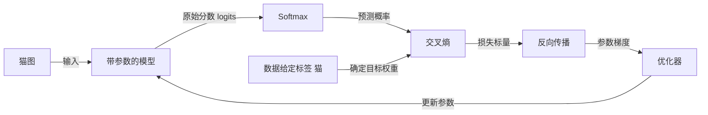
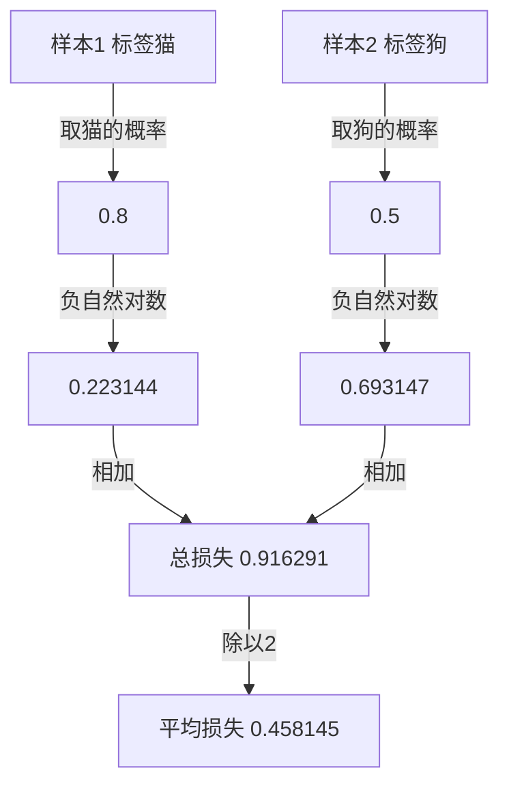

# 交叉熵：AI 怎样给概率预测打分

> 适用范围：单标签分类、自然对数、未加类别权重的平均损失。数值是人工构造的教学例子，不是模型测评。

核心问题：两个模型都把猫认成狗，只记一次“答错”，能看出它们的区别吗？

一句话答案：交叉熵按照给定答案，评价模型分配的概率。单个正确类别时，取这个类别的概率，再计算它的负对数；正确类别的概率越小，损失越大。

阅读准备：概率在0到1之间；本例猫、狗互斥且穷尽，两者概率相加为1。损失是训练要优化的数，不等于答错题目的比例。

## 1. 从同一张猫图开始

数据给定答案是猫。模型A给猫40%、狗60%；模型B给猫1%、狗99%。若只取概率最大的类别，两者都选狗，都答错。

但是两组概率并不相同。A至少给正确答案分配了40%，B只分配1%。要训练概率预测模型，我们希望评分能反映这种区别，而不只是记录最终选中的类别。

学完后应能计算一份损失、解释它为何变化，并分清损失、准确率和泛化表现。这里不讨论多标签任务，也不把损失当成事实核查系统。

## 2. 从目标推导评分规则

先明确三件事：模型输出概率，数据提供目标，损失函数比较二者。标签不是由模型自己的预测生成的。

0/1错误率在本例中很有用：它直接统计选错多少次。但猫概率从1%变到40%时，狗仍排第一，因此错误率没有变化。它没有记录概率分配的改善。

最少需要补上一把能比较概率分配的尺子。这不唯一决定必须使用对数；例如 `1-p` 也会随正确类别概率上升而下降。负对数的一个重要好处，是把多个样本概率的乘积变成可以相加的损失。

在条件独立的样本设定下，给定标签的整体似然是各样本正确类别概率的乘积。最大化这个乘积，等价于最小化它的负对数：对数单调递增，负号反转优化方向。

交叉熵更一般的定义，是用目标分布对预测概率的负对数求加权和。确定标签对应权重为1的正确类，其他类别权重为0。

## 3. 把一份损失算出来

类别顺序固定为“猫、狗”，目标为 `[1,0]`，模型A预测 `[0.4,0.6]`。

| 步骤 | 输入与操作 | 得到什么 |
| --- | --- | --- |
| 选择 | 给定答案为猫，取猫的预测概率 | p=0.4 |
| 取对数 | ln(0.4) | 约−0.916291 |
| 取负号 | −ln(0.4) | 约0.916291 |

保持标签不变，只调整预测概率，并同步让狗的概率为 `1-p`：

| 猫的概率 | 狗的概率 | 最大概率类别 | 猫为正确答案时的损失 |
| --- | --- | --- | --- |
| 0.01 | 0.99 | 狗 | 4.605170 |
| 0.40 | 0.60 | 狗 | 0.916291 |
| 0.90 | 0.10 | 猫 | 0.105361 |

前两行都答错，但损失不同。最后一行答对了，损失也不必恰好等于0。

## 4. 整体结构：评分不等于更新



**图4-1｜概率评分进入训练的计算链。** 从输入图像读到右侧，再沿更新箭头回到模型。反向传播还需要前向计算记录；图为职责总览，省略中间张量，不表示损失标量单独就足以求所有梯度。

Softmax负责将分数转成概率；交叉熵负责规定评分目标；反向传播依据计算图求梯度；优化器根据梯度和自身规则修改参数。某些实现把概率变换与损失融合计算，概念分工仍然可以分开理解。

## 5. 多个样本：先各取正确项，再合并

加入第二张图，给定答案为狗。假设第一张猫图正确项概率为0.8，第二张狗图正确项概率为0.5。



**图5-1｜两样本的平均损失。** 每个样本按自己的标签选项，不能都取猫，也不能都取最大概率。

按条件独立假设，整体似然为 `0.8×0.5=0.4`。由于 `ln(ab)=ln(a)+ln(b)`，其负对数恰好等于上述两份损失之和。0.4是这组给定答案的似然，不是40%的准确率。

若第一张图标签误写成狗，评分会选错目标；交叉熵不会自行发现标签错误。这是输入质量问题，不是靠换一个负号能修复的问题。

## 6. 公式到底表示什么

设有C个类别，预测概率为p，目标分布为q。各分量非负，分别加和为1。交叉熵为：

$$H(q,p)=-\sum_{i=1}^{C}q_i\ln p_i.$$

确定标签对应one-hot目标：正确类别权重1，其他权重0。因此简化为 `−ln(p正确)`。这不意味着其他原始分数对训练完全没有影响：Softmax的概率归一化仍依赖所有类别分数。

软目标例如 `[0.8,0.2]`，预测仍为 `[0.4,0.6]`，此时两项都要保留：

$$-0.8\ln(0.4)-0.2\ln(0.6)\approx0.835198.$$

对固定one-hot目标，`−ln(p)` 的导数是 `−1/p`。它说明损失随正确项概率增加而下降，但不是任意参数的梯度；参数梯度还依赖模型的计算链。

p趋近0时负对数趋向无穷；p=1时损失为0。有限精度实现可能出现溢出或下溢，因此工程实现往往直接从logits稳定计算，而不是先得到舍入为0的概率再取对数。

## 7. 自己验证一次

附件 [verify_examples.py](examples/verify_examples.py) 只使用Python 3标准库，无网络、无训练数据和第三方依赖。

```bash
python3 examples/verify_examples.py
```

它验证三组正确项概率、两样本的乘积与损失和、平均损失，以及软目标例子。成功标准不只是退出码0，还包括数值误差小于1e-12、三组损失严格递减、乘积取负对数等于逐项损失之和。

这是确定性的公式计算，不证明真实模型会按给定轨迹训练，也不评价模型性能。若断言失败，先检查类别顺序、是否使用自然对数、以及是否把均值与总和混淆。

## 8. 有效之处与不能保证的事

交叉熵保留了“同样对错、不同概率”的区别，并提供可组合的训练目标。代价是对低正确项概率更敏感；错误标签与异常样本可能产生很大的损失。

| 常见误解 | 更准确的理解 |
| --- | --- |
| 训练损失低，就一定能处理新数据 | 还需要独立验证泛化；低训练损失也可能来自记忆样本 |
| 输出90%就保证现实中90%正确 | 概率是否校准需检验，单个输出不构成保证 |
| 交叉熵知道真实答案 | 它依赖输入的目标，不能自动核验标签 |
| 损失下降就代表准确率每步上升 | 概率可以改善而最大类别不变；优化也不保证每步改善 |
| 交叉熵永远优于其他评分规则 | 取决于任务和建模目标，并非唯一损失函数 |

“意外度”只是负对数的数学解释，不意味着模型有惊讶、相信或后悔等情绪。训练评分和部署决策也是两回事：高风险决策可能需要额外阈值、校准与人工核验。

## 9. 换条件再想一遍

1. 猫概率由0.2升至0.3，仍然认成狗，损失是否改变？
2. 同一个预测 `[0.4,0.6]`，目标改成狗，损失是多少？
3. 两个模型准确率相同，只凭准确率能否断定交叉熵相同？

参考解答：第一题由约1.609降到1.204，最大类别不变但概率分配改变。第二题取狗的0.6，损失约0.511，而不是仍取猫的0.4。第三题不能；本例已经展示最大类别相同而正确项概率不同的情况。选模型仍需结合具体任务，而不只增加另一个单一排名指标。

## 10. 技术速查

同样答错却分配了不同概率 → 0/1评分看不出细微变化 → 标签确定目标 → 对正确项概率取负对数 → 合并样本损失 → 梯度与优化器负责更新。

- 单标签、无额外权重时：单样本损失为 `−ln(p正确)`。
- 多样本可相加或平均；本例平均值是总和除以样本数。
- 损失评价概率分配，不保证标签正确、概率校准或对新数据泛化。
