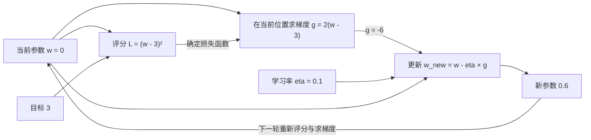

# 学习率：一次参数更新，到底应该改多少

> 适用范围：最基础的梯度下降。贯穿案例只有一个参数，采用确定的平方损失，不代表真实神经网络的训练实测。

核心问题：已经知道参数往哪边调整，为什么还需要学习率？

一句话答案：梯度描述当前位置的局部变化，学习率负责缩放这次更新的幅度；方向合适，不代表任意大的改动都合适。

阅读准备：参数是模型里可以调整的数字；损失是衡量输出与目标差异的评分，通常希望它变小。下面从能手算的例子开始，不要求先懂神经网络实现。

## 1. 先把任务缩小到一个数字

假设一个极简模型的输出就是参数 `w`。初始 `w=0`，希望输出接近 `3`。定义损失：

\[
L(w)=(w-3)^2
\]

参数为0，损失是9；参数为1，损失是4；参数为3，损失是0。因此，起点附近把参数往大了改有帮助。但改到6，损失又回到9；改到6.6，损失变成12.96。

需要区分两件事：**往哪个方向改**，以及**沿这个方向改多远**。

这个简单例子可以直接看出答案是3。采用迭代更新，不是因为这道题必须如此，而是为了单独观察训练算法的机制。真实模型通常有很多参数，不能把每个参数都直接设成样本标签。

## 2. 为什么局部方向还不够

梯度给出的信息是：当前位置稍微变化时，损失会怎样变化。在单参数情况下，梯度就是曲线斜率：

\[
g(w)=\frac{dL}{dw}=2(w-3)
\]

在 `w=0`，梯度是−6。负号表示在附近增大参数会降低损失。数值6描述局部变化率，不是到答案的距离，也不是要求参数直接增加6。

如果不另外缩放，直接使用 `w_new=w−g`，相当于隐含采用学习率1。本例第一步从0跳到6，下一步又回到0。问题不是没有使用任何步长，而是这个默认步长不合适。

最小的补充就是一个缩放系数，通常用 `η` 表示，称为**学习率**：

\[
w_{t+1}=w_t-\eta g(w_t)
\]

对最基础的梯度下降，正学习率保持负梯度方向，同时控制幅度。实际改变量是 `−ηg`，因此它同时受学习率和梯度影响。

## 3. 把一次更新完整算出来

初始参数0，学习率0.1。

|步骤|运算|得到什么|
|---|---|---|
|评分|`(0−3)²`|损失9|
|算局部变化|`2×(0−3)`|梯度−6|
|缩放|`0.1×(−6)`|−0.6|
|更新|`0−(−0.6)`|新参数0.6|
|重新评分|`(0.6−3)²`|损失5.76|

减去负数相当于增加，所以点向右移动。新位置损失更低，说明这一次更新确实改善了评分。

下一次不能继续无条件使用旧梯度−6。到 `w=0.6` 后重新计算：

\[
g=2(0.6-3)=-4.8,\qquad
w_{next}=0.6-0.1(-4.8)=1.08
\]

实际改变量从0.6缩小到0.48，但学习率仍是0.1。**点移动得越来越少，不一定意味着学习率变小了。**

## 4. 看清各个量的职责



图4-1｜单参数梯度下降的计算关系。梯度由损失函数在当前点的导数得到，不是只凭“损失9”这个标量就能反推出梯度。回路表示下一次迭代，不表示参数自动恢复成0。

损失函数确定“怎样算错”；梯度确定局部变化；学习率缩放更新；更新后的参数进入下一轮。学习率不负责决定一次读多少数据，也不表示每秒学到多少知识。

## 5. 连续更新时会发生什么

保持同一个起点、同一个损失函数，只改变学习率：

|学习率|前几次参数|本例中的表现|
|---|---|---|
|0.01|0 → 0.06 → 0.1188|前进较慢|
|0.1|0 → 0.6 → 1.08|逐步接近3|
|0.8|0 → 4.8 → 1.92 → 3.648|左右交替，但越来越接近3|
|1|0 → 6 → 0 → 6|往返不改善，损失始终9|
|1.1|0 → 6.6 → −1.32 → 8.184|离3越来越远|

这解释了两个看似矛盾的现象：步长大可能更快，也可能完全无法接近目标；越过最低点一次可能继续收敛，也可能开始发散。不能只凭一次越界下结论。

迭代也需要停止条件，例如预先设定更新次数，或检查改变量与损失变化是否足够小。本例的验证脚本只运行固定次数，不宣称得到真实训练中的最优停止策略。

## 6. 为什么这些行为能精确区分

将本例梯度代入更新规则：

\[
w_{t+1}=w_t-2\eta(w_t-3)
\]

把两边都减3：

\[
w_{t+1}-3=(1-2\eta)(w_t-3)
\]

令误差 `e_t=w_t−3`，每次更新就是把误差乘以 `1−2η`。这是本例可以直接判断收敛的原因：

- `0<η<0.5`：误差不换符号，绝对值缩小。
- `η=0.5`：一次到达3，只适用于这条精确的二次函数。
- `0.5<η<1`：误差正负交替，但绝对值缩小。
- `η=1`：误差换符号、大小不变。
- `η>1`：从非最优起点出发，误差绝对值扩大。

如果起点已经是3，则梯度为0，以上所有学习率下都保持不动。

这些阈值不是神经网络的通用经验值。把损失整体乘以10，梯度也乘以10，更新变为 `w_new=w−20η(w−3)`；本例的收敛范围相应变成 `0<η<0.1`。最优参数仍是3，但原来的学习率0.1已经处在往返边界。

## 7. 自己验证一次

用 Python 3 运行同目录的 [最小验证脚本](examples/check_learning_rate.py)，无第三方依赖：

```bash
python3 examples/check_learning_rate.py
```

脚本逐步计算参数与损失，核查0.1的第一次更新、固定学习率下改变量缩小、0.8的交替收敛、1的往返、1.1的扩张，以及损失尺度改变后的更新。

也可以手算第五次更新：0.1时 `w≈2.01696`，0.01时 `w≈0.28824`。比较的是相同更新次数，不是同样运行秒数。

这些是确定公式的数值验证，不涉及训练数据、GPU或实际神经网络，因此不能据此给出其他模型的推荐学习率。

## 8. 现实训练的边界

### 两种曲线不要混淆

|图|横轴|纵轴|回答的问题|
|---|---|---|---|
|损失地形的单参数切片|参数值|损失|不同参数各得多少分？|
|训练日志|更新次数或训练进度|记录的损失|一路更新下来发生了什么？|

真实训练可能每次只使用一小批样本。换批次后，梯度及记录的损失都可能变化。日志一次上升，不足以证明学习率设置错误；需要结合持续趋势和其他训练条件判断。

### 学习率可以随阶段改变

后期逐渐降低学习率，可以让调整更细；预热是从较小学习率逐渐升高，用来降低训练初期不稳定的风险。它们是可选择的训练策略，不表示学习率必须从头不变，也不表示所有任务都应一直递减。

### 哪些结论不能外推

较小学习率可能需要更多次更新，过大可能振荡或发散；但“越小越好”和“越大越快”都不成立。本例讨论最基础的梯度下降，没有动量或自适应缩放。多参数、随机批次、其他优化器都会改变具体行为。合适的学习率也不能保证每一步都降低损失，更不能单独保证泛化良好或找到最好的模型。

## 9. 三道判断题

1. 学习率固定，实际改动越来越小，是否矛盾？
2. 本例学习率0.8，第一次跳过3，是否失败？
3. 损失整体乘10，学习率应该如何改变，才能保留原来同样的更新？

参考解答：

1. 不矛盾。实际改变量是 `−ηg`。η固定时，梯度绝对值变小也会使改变量缩小。
2. 不失败。误差每次乘 `−0.6`，符号交替但绝对值缩小，所以收敛到3。
3. 在同一参数和最基础梯度下降下，把学习率除以10，可以抵消梯度乘10的变化。此结论建立在只改变评分尺度、其他条件不变的前提下。

## 10. 技术速查

当前参数 → 计算损失和梯度 → 学习率缩放 → 更新参数 → 到新位置重新计算。

记住三点：学习率控制更新幅度；实际步长还取决于梯度；局部下降方向不等于远处落点保证更好。
